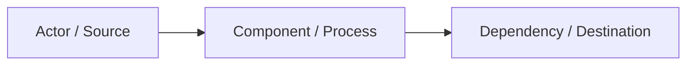

# ARCHITECTURE

Status: TEMPLATE

## System / Process Overview

Describe only the current confirmed architecture. Prefer Mermaid for relationships.

## Components

### Component Name

- Purpose:
- Owner:
- Depends on:
- Used by:
- Boundary:
- Current version/state:

## Data / Traffic / Process Flows

Document material flows and trust boundaries.

## Constraints

- TBD

## Architecture Debt

- None recorded.
